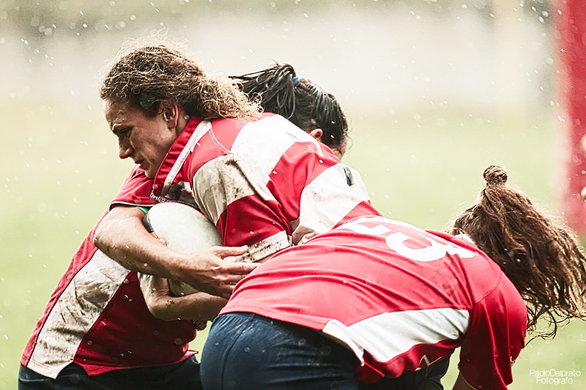

# Visual Analysis

A custom skill that produces a deep, curatorial reading of one image and delivers a formatted PDF containing that image.

Current version: 0.24.4. See the [changelog](CHANGELOG.md).

## What it does

Visual Analysis examines what an image communicates and how its visual choices produce that meaning. It covers:

- Composition and visual hierarchy: what attracts the eye, where it moves, and how figures, spaces, and directions relate.
- Light and tonal values: distribution, shadows, highlights, contrast, and expressive function.
- Color: relationships, emphasis, separation, and atmosphere.
- Technical reading: visible choices appropriate to photography, painting, drawing, illustration, or graphic design.
- Action and narrative: gestures, opposing forces, and possible developments that a single frame leaves unresolved.
- Strengths and limits: specific judgments supported by visible details.
- Artistic and photographic references: only when relevant, with a consistency check between the interpretation and its sources.

It analyzes photographs, paintings, drawings, illustrations, digital art, posters, covers, logos, and other images with an aesthetic purpose. Charts, tables, and operational diagrams are outside its scope.

It reads the work as presented. It does not propose retouching, alternate compositions, or changes to the author's work.

## How it works

1. Image reading: examines the attached image and identifies the relationships that matter.
2. Interpretation: explains what the image communicates and connects each judgment to visible evidence.
3. Critical review: checks technical claims, strengths and limits, and the consistency of artistic references.
4. PDF: produces a sober editorial document with the complete image, the analysis, and a final critical synthesis.

The report follows the language of the request or conversation. English is the fallback when no other language can be determined. The English source instructions do not restrict the report language.

## Example: sports photography

*Photograph by Paolo Dalprato. English translation of an analysis produced with Visual Analysis.*

### The breaking point

The frame holds a crucial phase of contact in rugby: one player protects the ball against her body while two others close around her from different directions. Her contracted face and tightly held arms register an effort still in progress. We see neither a try nor a completed stop. The question the image opens is concrete: will she break through, or will the combined pressure halt her advance?

The photograph makes this uncertainty visible through bodies converging on the ball, a very close viewpoint that removes the context of the field, and an instant brief enough to leave droplets suspended in the air. Movement is perceptible precisely because it is arrested where the forces oppose each other, before either prevails.

Read the full curatorial analysis

### Visual hierarchy and the path of the eye

The large red back in the foreground occupies much of the frame and attracts attention through its mass and saturation. The eye then moves to the pale ball, held tightly between the arms, and rises to the ball carrier's face, the most expressive dark profile against the luminous background. From there, the head emerging behind her and the body bent low return the gaze to the center of contact. The ball is the narrative pivot; the face conveys its physical cost.

### Composition and vectors of force

The ball carrier inclines her shoulders and head toward the left, in the direction the edge of the frame intuitively leaves open. The foreground figure enters from the right and below: her curved back forms a broad diagonal that crosses and compresses the central torso. A second presence, high and partly hidden behind the ball carrier, closes the space at her back. The arms surrounding the ball form a knot of short lines, in contrast with the diagonals of the torsos. The composition repeatedly draws the eye back to the point where possession is contested.

### Dynamics and suspense

The ball is still firmly protected, and the carrier's body retains a direction: these are signs of possible forward movement. Yet the other two figures have already reduced her room to maneuver. The foreground player appears to engage the lower body, while the other applies pressure around the shoulders. The image contains signs supporting both outcomes without proving either. The close framing prevents us from seeing foot placement, the field line, or subsequent developments. The viewer feels the urgency of the action while remaining within its present moment.

### Photographic time

The separated droplets, lifted hair, and taut folds of the shirts are traces of motion frozen in place. The photograph does not depict bodies posing; it selects a fraction of a second in which every gesture still seems capable of changing direction. This suspension of time intensifies the question of what happens next.

### Light, color, and material

The light is broad and soft. It produces no sharp shadows, but makes the background and suspended droplets luminous. The edges of the hair receive slight tonal separation, while the face remains relatively darker. This relationship allows the expression to be read without separating it from the physical effort of contact. The mud-marked white panels of the shirts retain the material memory of play. Vivid red binds the figures into a compact mass against the pale greens and grays of the background. Color contrast isolates the action, while the similarity of the shirts makes the bodies less immediately distinguishable.

### Technical reading

The view is tight and at body height, with a strongly blurred background separating the group from its surroundings. The face, ball, and fabric in the central areas retain enough detail to support the reading; the red form at the far right is out of focus. Frozen droplets suggest a short exposure, but shutter speed, aperture, and focal length cannot be recovered from the JPEG alone. The rendering is bright, with luminous whites and intense reds. It cannot confidently be attributed to the scene's lighting, the camera, or later processing. The supplied file measures 1000 x 667 pixels, so the assessment of fine detail is limited to this version.

### Reference and visual language

The image belongs to the language of action sports photography and has a relationship with reportage: a real event is condensed into an instant that is both legible and open. The frame selects a crucial moment, but its strength does not derive from orderly geometry. It arises from the collision of bodies and uncertainty over which force will prevail. The relevant reference is therefore the visual narration of action, without needing to assign the photograph to a particular author or movement.

### Strength and weakness

The strength is the coincidence of visual structure and sporting conflict: diagonals converge on the ball, the face gives human scale to the collision, and the arrested instant keeps the possibility of breaking through or being stopped open. The main limitation is the legibility of the physical relationships. The large foreground figure hides part of the grip, and similar shirts merge the players into a single volume. This opacity conveys the pressure of close contact, but prevents a precise understanding of which gesture will determine the outcome.

### Critical synthesis

The photograph presents rugby as a collision between will and resistance. Its effectiveness lies in making the uncertainty of the outcome felt, and in turning a very brief contact into a scene that continues mentally beyond the frame.

## Requirements

A signed-in environment that supports custom skills and can read images: Codex Desktop, Claude Chat, Claude Desktop Chat, or Cowork. The same skill ZIP supports manual installation in Codex Desktop and account upload in Claude.

PDF creation requires code execution and file creation to be enabled in the host. Visual Analysis uses the host's model and available tools.

## Installation

### Codex Desktop

1. Download [visual-analysis-skill.zip](https://github.com/paolodalprato/visual-analysis/releases/latest/download/visual-analysis-skill.zip).
2. Extract it. The archive contains a folder named visual-analysis.
3. Copy that entire folder into your personal skills directory:

| Operating system | Destination |
| --- | --- |
| Windows | `C:\Users\<username>\.agents\skills\` |
| macOS / Linux | `~/.agents/skills/` |

Create the skills directory if it does not exist. The resulting file must be `.agents/skills/visual-analysis/SKILL.md`.

Start a new conversation in Codex Desktop and select Visual Analysis from the skill picker, or type `$visual-analysis`. If the skill does not appear, restart the application.

You can also copy the visual-analysis folder directly from this repository. Keep SKILL.md, agents, and assets together.

### Claude Chat, Desktop Chat, and Cowork

1. Download [visual-analysis-skill.zip](https://github.com/paolodalprato/visual-analysis/releases/latest/download/visual-analysis-skill.zip) from the [latest release](https://github.com/paolodalprato/visual-analysis/releases/latest), or use the copy in the repository root.
2. Keep the ZIP intact.
3. Open Claude and go to **Customize > Skills**.
4. Select **+**, then **Create skill**, then **Upload a skill**.
5. Upload the ZIP and enable Visual Analysis.

## Verify the installation

Start a conversation and attach one image. In Codex Desktop, select Visual Analysis or type `$visual-analysis`. In Claude, ask it to use Visual Analysis on the image.

No title, author, camera settings, or other preliminary details are required. The PDF should contain the image and a specific, supported reading of it.

## Updates and removal

In Codex Desktop, update by replacing the installed visual-analysis folder with the new version. To remove it, remove that folder from your personal skills directory.

In Claude, update by uploading the latest skill ZIP through **Customize > Skills**. Remove it through the same settings.

## Structure

    visual-analysis/
    |-- SKILL.md
    |-- LICENSE
    |-- agents/
    |   +-- openai.yaml
    +-- assets/
        +-- icon.png
    examples/
    +-- rugby.jpg
    visual-analysis-skill.zip
    README.md
    CHANGELOG.md
    LICENSE

The upload archive contains only the visual-analysis skill folder. The example photograph and README analysis belong to the repository documentation and are not included in the installed skill.

## Scope and limitations

The skill can identify visible technical effects, but it cannot reliably recover camera settings, equipment, authorship, or an event's outcome from appearance alone. It distinguishes observations from interpretations.

The skill contains no user photographs, sample reports, credentials, connectors, or marketplace configuration. It does not upload images itself; the selected host handles the conversation and its attachments.

If the host cannot generate a PDF, Visual Analysis provides the complete analysis in the conversation and explains the file creation limitation.

## Contributing

Issues and pull requests are welcome. Useful reports include the host and the behavior observed. Image examples should be shared only with the appropriate rights.

## Documentation

- [OpenAI: local skills](https://learn.chatgpt.com/docs/build-skills)
- [Claude: upload and use custom skills](https://support.claude.com/en/articles/12512180-use-skills-in-claude)
- [Claude: create custom skills](https://support.claude.com/en/articles/12512198-how-to-create-custom-skills)

## License

[MIT](LICENSE). Copyright (c) 2026 Paolo Dalprato.

The license is included in both the repository and the skill folder.

## Authors

- Author: Paolo Dalprato.
- Co-author: GPT-6 Sol (OpenAI), for the development of the analytical workflow, instructions, and distribution package in collaboration with Paolo Dalprato.
